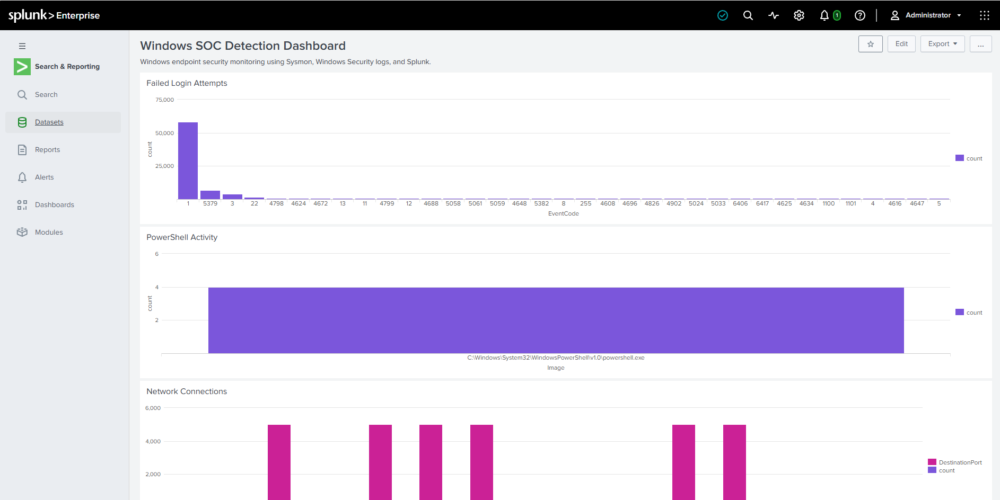
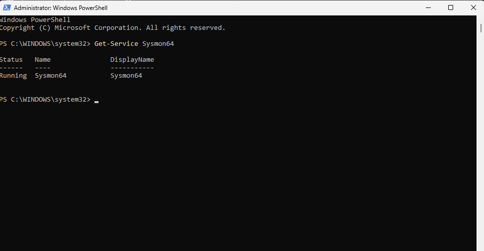
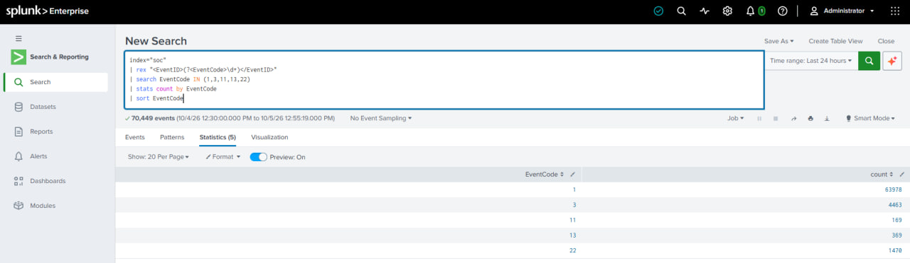

# Windows SOC Detection & Incident Investigation Lab

A hands-on cybersecurity home lab designed to simulate a Security Operations Center (SOC) workflow using Windows 11, Sysmon, Splunk Enterprise, Windows Security logs, and MITRE ATT&CK.

## Project Overview

This project demonstrates how a junior SOC analyst can collect endpoint telemetry, search and investigate security events, build detections, correlate evidence, and map relevant activity to MITRE ATT&CK techniques.

The lab uses a Windows 11 endpoint as the monitored system and a Kali Linux VM for controlled security testing.

## Architecture

## Architecture

```text
Windows 11 Endpoint
├── Sysmon
│   └── Endpoint telemetry
├── Windows Security Logs
│   └── Authentication and security events
└── Splunk Enterprise
    └── SIEM / Detection / Investigation

Kali Linux VM
└── Controlled security testing
```

## Tools & Technologies

- Windows 11
- Kali Linux
- VMware
- Sysmon
- Splunk Enterprise
- PowerShell
- Windows Event Logs
- MITRE ATT&CK
- Wireshark
- GitHub

## SOC Workflow

Detection → Investigation → Evidence Collection → MITRE Mapping → Assessment → Documentation

## Detections Implemented

### 1. PowerShell Process Execution

- Sysmon Event ID: 1
- Detection of PowerShell process execution
- Command-line investigation
- MITRE ATT&CK: T1059.001

### 2. Failed Windows Logins

- Windows Security Event ID: 4625
- Failed authentication monitoring
- Username and source investigation
- MITRE ATT&CK: T1110

### 3. Process Creation

- Sysmon Event ID: 1
- Process and parent-process investigation
- Command-line analysis
- MITRE ATT&CK: T1059.003 for the controlled Windows Command Shell test

### 4. File Creation Monitoring

- Sysmon Event ID: 11
- Monitoring file creation in user-writable locations
- Process and user investigation
- ATT&CK mapping not assigned without sufficient evidence

### 5. Network Connection Monitoring

- Sysmon Event ID: 3
- Destination IP and port investigation
- Protocol analysis
- ATT&CK mapping not assigned without sufficient evidence

### 6. DNS Query Monitoring

- Sysmon Event ID: 22
- DNS query investigation
- Process-to-domain correlation
- ATT&CK mapping not assigned without sufficient evidence

## Splunk Dashboard

The project includes a Splunk dashboard containing:

- Event Distribution
- Failed Login Attempts
- PowerShell Activity
- Top Network Destinations
- DNS Queries
- Process Creation
- Windows Security Events
- SOC Severity Summary

## Evidence

### Splunk SOC Dashboard


### Sysmon Service Running


### Sysmon Events in Splunk


## MITRE ATT&CK

The project uses MITRE ATT&CK to provide context for observed behavior.

Current mappings include:

| Detection | Technique |
|---|---|
| PowerShell | T1059.001 |
| Failed Login / Brute Force | T1110 |
| Windows Command Shell | T1059.003 |

Techniques are assigned only when the collected evidence supports the mapping.

## Controlled Testing

The lab includes controlled tests such as:

- PowerShell execution with `SOC_TEST_123`
- Failed authentication using `FakeSOCUser`
- Controlled `cmd.exe` execution using `SOC_PROCESS_TEST`
- File creation monitoring
- Network connection monitoring
- DNS query monitoring

The tests were performed on the user's own lab environment for detection validation.

## Investigation Approach

For each detection, the following process was followed:

1. Identify the event
2. Extract relevant fields
3. Investigate the process/user/domain/IP
4. Determine whether the activity appears benign or requires further investigation
5. Map to MITRE ATT&CK when supported
6. Document the findings

## Key Learning Outcomes

- Windows endpoint telemetry collection
- Sysmon event analysis
- Splunk SPL searches
- Windows Security event investigation
- Process and parent-process analysis
- PowerShell monitoring
- Network and DNS investigation
- MITRE ATT&CK mapping
- SOC-style documentation
- Detection engineering fundamentals

## Disclaimer

This is a personal cybersecurity lab created for educational and defensive security purposes. Testing was performed in a controlled environment.
